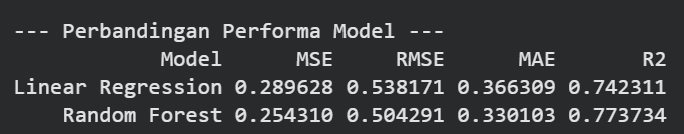

# Individual Household Electric Power Consumption Analysis

Proyek ini melakukan analisis data secara menyeluruh (End-to-End Data Analysis) menggunakan dataset **Individual Household Electric Power Consumption** dari UCI ML Repository. Analisis mencakup pembersihan data (*Data Quality*), analisis deskriptif, analisis diagnostik, hingga pemodelan prediktif untuk memperkirakan konsumsi daya aktif rumah tangga.

---

## 📌 Ringkasan Hasil Analisis
1. **Data Quality**: Berhasil memproses **2.049.280 baris bersih** dari total awal 2.075.259 baris (0 duplikat & 181.853 *missing value* ditangani dengan baik).
2. **Descriptive Analytics**: Konsumsi rata-rata listrik rumah tangga adalah **1,09 kW**, dengan beban tertinggi berada pada kategori `Sub_metering_3` (Pemanas Air & AC) yang menyumbang **72,7%** dari total energi yang termonitor secara spesifik.
3. **Predictive Analytics**: Model **Random Forest** ($R^2 = 0.774$) terbukti lebih akurat dalam memprediksi penggunaan daya dibandingkan **Linear Regression** ($R^2 = 0.742$). Fitur yang paling berpengaruh secara dominan adalah `Sub_metering_3`.

---

## 📊 Tahapan Proyek

### 1. Load Dataset
Dataset dibaca dari file `household_power_consumption.txt` dengan resolusi per menit dari rentang waktu **16 Desember 2006 hingga 26 November 2010** (~4 tahun). Data awal terdiri dari 2.075.259 baris dan 9 kolom: `Date`, `Time`, dan 7 fitur numerik.

### 2. Data Quality & Pembersihan Data
* **Missing Values**: Ditemukan 25.979 *missing value* (berupa tanda `?`) pada setiap kolom numerik yang berasal dari baris yang sama (indikasi alat ukur sempat *offline*). Baris ini dihapus sehingga menyisakan **2.049.280 baris data bersih (98,74%)**.
* **Analisis Outlier**: Menggunakan metode IQR pada `Global_active_power`, didapatkan batas atas wajar sebesar **3,36 kW**. Terdapat 94.907 baris (4,63%) data yang berada di atas batas tersebut. 
* *Catatan*: Nilai pencilan (*outlier*) ini **tidak dihapus** karena merepresentasikan kejadian nyata di lapangan (misal: AC, oven, dan pemanas air menyala bersamaan).

### 3. Descriptive Analytics (Eksplorasi Data)
* **Karakteristik Data**: Rata-rata konsumsi daya aktif berada pada **1,09 kW** (rentang 0,076 - 11,12 kW) dengan tegangan rata-rata sebesar **240,8 V**.
* **Distribusi**: Fitur `Global_active_power` memiliki distribusi *right-skewed* dan *bimodal* (memiliki dua puncak):
  * Puncak 1 (~0,3 kW): Kondisi rumah *standby* / beban dasar.
  * Puncak 2 (~1,4 kW): Kondisi penggunaan aktif.

* **Pola Musiman (Seasonal)**: Konsumsi listrik melonjak pada bulan **Desember - Februari** (musim dingin, kebutuhan pemanas) dan mencapai titik terendah pada **Juli - Agustus** (musim panas).

* **Pola Harian & Mingguan**: 
  * Aktivitas harian mencapai puncak tertinggi pada **pukul 20.00** (1,90 kW) dan rutinitas pagi pukul 07.00 - 08.00 (~1,5 kW).
  * Konsumsi pada akhir pekan (**Sabtu: 1,25 kW, Minggu: 1,22 kW**) lebih tinggi dibanding hari kerja biasa.

### 4. Diagnostic Analytics
* **Data Leakage Prevention**: Berdasarkan *Correlation Matrix*, fitur `Global_intensity` memiliki korelasi sempurna **1,00** dengan `Global_active_power` karena hubungan fisik hukum daya ($P = V \times I$). Fitur ini **sengaja dikeluarkan** dari model prediktif untuk menghindari *data leakage*.

* **Mekanisme Lonjakan Listrik**:
  * **Beban Stabil Tinggi**: Diwakili oleh `Sub_metering_3` (Pemanas Air & AC) yang mengambil porsi 35,5% dari total energi rumah tangga global atau 72,7% dari total energi yang termonitor via sub-meter.
  * **Pemicu Outlier**: Saat terjadi konsumsi ekstrem (>3,36 kW), daya pada `Sub_metering_1` (Dapur) melonjak hingga **45x lipat** dan `Sub_metering_2` (Ruang Cuci) melonjak **18x lipat**. Dapat disimpulkan bahwa *outlier* dipicu oleh aktivitas dapur dan laundry yang berjalan bersamaan.

* **Voltage Drop**: Ditemukan korelasi negatif antara Tegangan (*Voltage*) dan Daya Aktif (-0,40). Analisis diagnostik membuktikan bahwa tegangan turun secara monoton dari **241,88 V** (daya <0.5 kW) menjadi **237,21 V** (daya >3 kW) akibat impedansi jaringan saat arus naik (Hukum Ohm).

---

## 🤖 Pemodelan Prediktif

Pemodelan dilakukan untuk memprediksi nilai `Global_active_power` menggunakan fitur `Voltage`, `Global_reactive_power`, `Sub_metering_1`, `Sub_metering_2`, dan `Sub_metering_3`. Data dibagi secara acak dengan proporsi **80% Training dan 20% Testing**.

### Perbandingan Performa Model

| Metrik Evaluasi | Linear Regression | Random Forest Regressor |
| :--- | :---: | :---: |
| **MAE** | 0.3663 | **0.3301** |
| **MSE** | 0.2896 | **0.2543** |
| **RMSE** | 0.5382 | **0.5043** |
| **R² Score** | 0.7423 | **0.7737** |

### Insights Utama dari Model:
1. **Random Forest** mengungguli Linear Regression di semua metrik evaluasi karena mampu menangkap hubungan *nonlinear* serta interaksi kompleks antar sub-metering.
2. Pada **Linear Regression**, `Global_reactive_power` memiliki koefisien terbesar (0,867) karena skala fiturnya yang kecil. Namun pada **Random Forest**, `Sub_metering_3` menjadi fitur yang paling dominan (*Feature Importance* sebesar 0,539) dalam menentukan akurasi prediksi.
3. Kedua model menunjukkan performa prediksi yang sangat presisi pada rentang konsumsi **0-2 kW**, namun akurasinya cenderung melebar pada konsumsi **>3 kW** karena jumlah data *event* ekstrem yang relatif sedikit di dalam dataset (*imbalanced data distribution*).

---

## 🛠️ Tech Stack & Library
* **Bahasa Pemrograman**: Python
* **Data Manipulation**: Pandas, NumPy
* **Statistical & Diagnostic Analytics**: Scikit-Learn, Interquartile Range (IQR), Correlation Matrix
* **Machine Learning**: Linear Regression, Random Forest Regressor
