# 🏠 Analisis Konsumsi Energi Rumah Tangga
### *Individual Household Electric Power Consumption — UCI ML Repository*
 
> **Tujuan Proyek:** Menganalisis pola konsumsi energi listrik rumah tangga menggunakan pendekatan **Descriptive**, **Diagnostic**, dan **Predictive Analytics**, serta menghasilkan rekomendasi bisnis berbasis data untuk perusahaan utilitas (PLN).
 
---
 
## 📊 Dataset
 
| Atribut | Detail |
|---|---|
| **Sumber** | [UCI ML Repository](https://archive.ics.uci.edu/dataset/235/individual+household+electric+power+consumption) |
| **File** | `household_power_consumption.txt` |
| **Delimiter** | `;` |
| **Penanda Missing Value** | `?` |
| **Total Baris (Awal)** | 2.075.259 |
| **Total Kolom** | 9 |
| **Rentang Waktu** | 16 Desember 2006 – 26 November 2010 (~4 tahun) |
| **Resolusi** | Per menit |
 
### Deskripsi Kolom
 
| Kolom | Tipe | Deskripsi |
|---|---|---|
| `Date` | String | Tanggal pengukuran |
| `Time` | String | Waktu pengukuran |
| `Global_active_power` | Float | Total daya aktif yang ditarik dari jaringan (kW) — **Target Variabel** |
| `Global_reactive_power` | Float | Daya reaktif global (kW) |
| `Voltage` | Float | Tegangan rata-rata (V) |
| `Global_intensity` | Float | Intensitas arus global (A) |
| `Sub_metering_1` | Float | Sub-meter 1 — Dapur: Dishwasher, Oven, Microwave (Wh/menit) |
| `Sub_metering_2` | Float | Sub-meter 2 — Ruang Cuci: Mesin Cuci, Pengering, Kulkas (Wh/menit) |
| `Sub_metering_3` | Float | Sub-meter 3 — Pemanas Air & AC (Wh/menit) |
 
---
## ⚙️ 1. Metode & Pipeline Big Data

Berikut adalah alur kerja (*pipeline*) yang diterapkan dalam proyek analisis konsumsi daya listrik ini. Pendekatan yang digunakan mencakup persiapan data hingga pemodelan prediktif untuk menghasilkan *insight* yang komprehensif.

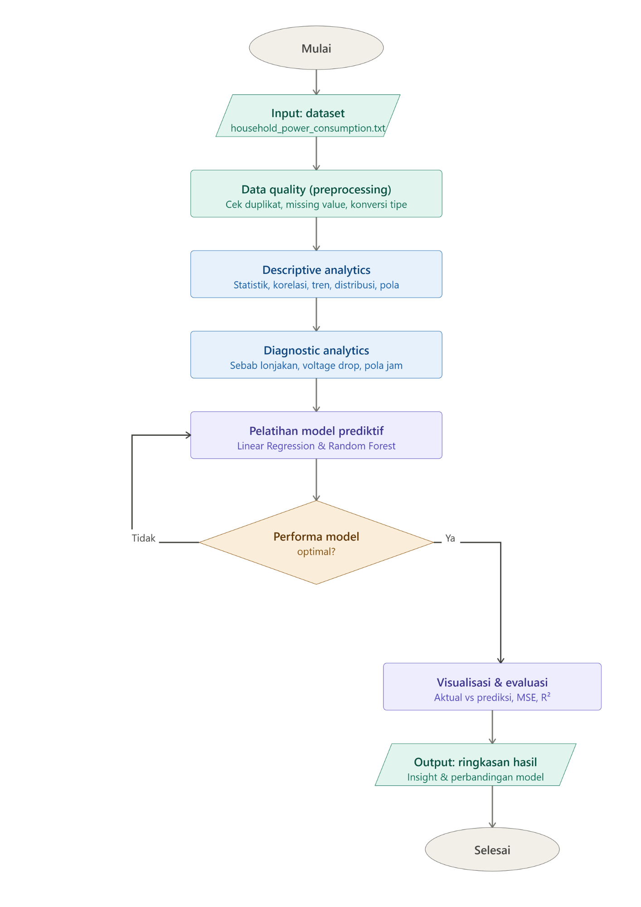

Alur kerja proyek ini dibagi menjadi tiga fase utama, yaitu **Preprocessing**, **Descriptive & Diagnostic**, serta **Predictive**. Berikut adalah rincian dari setiap tahapan:

### 1. Data Ingestion (Input Data)
Proses dimulai dengan memuat dataset mentah.
* **Sumber Data:** File teks `household_power_consumption.txt` yang berisi rekaman penggunaan daya listrik rumah tangga.

### 2. Data Quality & Preprocessing
Tahap fundamental untuk memastikan data yang akan dianalisis valid dan bersih.
* **Pembersihan:** Pengecekan dan penghapusan baris data yang duplikat.
* **Imputasi:** Penanganan nilai kosong (*missing value*) pada dataset.
* **Transformasi:** Konversi tipe data (seperti penggabungan fitur tanggal dan waktu menjadi format `Datetime` yang terstandardisasi).

### 3. Descriptive Analytics
Fase eksplorasi awal untuk memahami karakteristik dasar dari data historis.
* **Statistik Deskriptif:** Menghitung ringkasan statistik dari setiap variabel.
* **Eksplorasi:** Memetakan matriks korelasi antar variabel, melihat tren runtut waktu (harian vs bulanan), serta menganalisis distribusi dan pola konsumsi listrik secara umum.

### 4. Diagnostic Analytics
Analisis lanjutan untuk mencari tahu penyebab atau alasan di balik pola yang ditemukan pada tahap deskriptif.
* **Identifikasi Anomali:** Menganalisis pemicu lonjakan daya ekstrem (*outlier*).
* **Investigasi Teknis:** Memvalidasi fenomena penurunan tegangan (*voltage drop*) saat beban puncak.
* **Pola Perilaku:** Mendiagnosis pola penggunaan listrik per jam dalam sehari.

### 5. Pelatihan Model Prediktif (Predictive Modeling)
Membangun model *Machine Learning* untuk memprediksi total konsumsi daya (`Global_active_power`).
* **Algoritma:** Model dilatih menggunakan metode **Linear Regression** dan **Random Forest Regressor**.

### 6. Evaluasi & Tuning Model
Tahap validasi untuk memastikan algoritma belajar dengan baik.
* **Pengecekan Optimalisasi:** Mengukur apakah model sudah mencapai performa yang ditargetkan. Jika *TIDAK*, *pipeline* akan melakukan iterasi kembali ke tahap pelatihan model. Jika *YA*, proses berlanjut ke tahap visualisasi evaluasi.
* **Metrik Evaluasi:** Membandingkan sebaran data prediksi dengan data aktual menggunakan metrik *Mean Squared Error* (MSE) dan R-Squared ($R^2$).

### 7. Output & Ringkasan Hasil
Hasil akhir dari keseluruhan *pipeline*.
* **Penyajian Data:** Melaporkan perbandingan performa antar model yang diuji.
* **Ekstraksi Nilai:** Menghasilkan *insight* akhir yang dapat ditindaklanjuti (*actionable*) untuk keperluan efisiensi kelistrikan atau pemeliharaan infrastruktur.
 
## 🧹 2. Data Quality (Pembersihan Data)
 
### Hasil Pengecekan Kualitas Data
 
| Pemeriksaan | Hasil |
|---|---|
| Baris duplikat | **0** |
| Missing value per kolom numerik | 25.979 baris |
| Total sel kosong | 181.853 |
| Baris setelah pembersihan | **2.049.280** |
| Persentase data dipertahankan | **98,74%** |
 
> 💡 Seluruh missing value berasal dari baris yang sama — kemungkinan akibat periode alat ukur yang sedang *offline*. Baris-baris ini dibuang seluruhnya.
 
### Deteksi Outlier (Metode IQR) pada `Global_active_power`
 
| Parameter | Nilai |
|---|---|
| Batas atas wajar (IQR) | **3,36 kW** |
| Data di atas batas | 94.907 baris (4,63%) |
| Tindakan | **Dipertahankan** |
 
> 💡 Outlier tidak dihapus karena merepresentasikan kejadian nyata (penggunaan alat berdaya besar secara bersamaan), bukan kesalahan input data.
 
---
 
## 📈 3. Descriptive Analytics (Eksplorasi Data)
 
### Statistik Deskriptif Variabel Utama
 
| Statistik | `Global_active_power` | `Voltage` | `Global_intensity` |
|---|---|---|---|
| **Count** | 2.049.280 | 2.049.280 | 2.049.280 |
| **Mean** | 1,09 kW | 240,84 V | 4,63 A |
| **Std** | 1,06 kW | 3,24 V | 4,44 A |
| **Min** | 0,076 kW | 223,2 V | 0,2 A |
| **25%** | 0,308 kW | 238,99 V | 1,4 A |
| **Median (50%)** | 0,602 kW | 241,01 V | 2,6 A |
| **75%** | 1,528 kW | 242,89 V | 6,4 A |
| **Max** | 11,12 kW | 254,15 V | 48,4 A |
 
### Distribusi Global Active Power
 
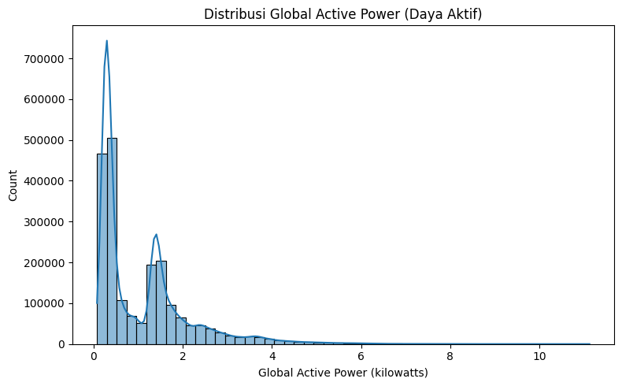
 
Distribusi bersifat **right-skewed dan bimodal**:
- **Puncak 1** (~0,3 kW) → ~750.000 data: kondisi *standby* / beban dasar rumah
- **Puncak 2** (~1,4 kW) → ~270.000 data: kondisi penggunaan aktif
- Ekor panjang memanjang hingga **11 kW**
### Tren Waktu — Harian vs Bulanan
 
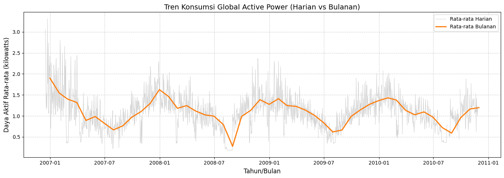
 
Terdapat **pola musiman tahunan yang konsisten** selama 2007–2010:
 
| Periode | Konsumsi Rata-rata | Keterangan |
|---|---|---|
| Desember – Februari | ~1,4 – 1,9 kW | Musim dingin — kebutuhan pemanas tinggi |
| Juli – Agustus | ~0,6 – 0,9 kW | Musim panas — konsumsi turun |
 
### Pola Konsumsi per Jam dalam Sehari
 
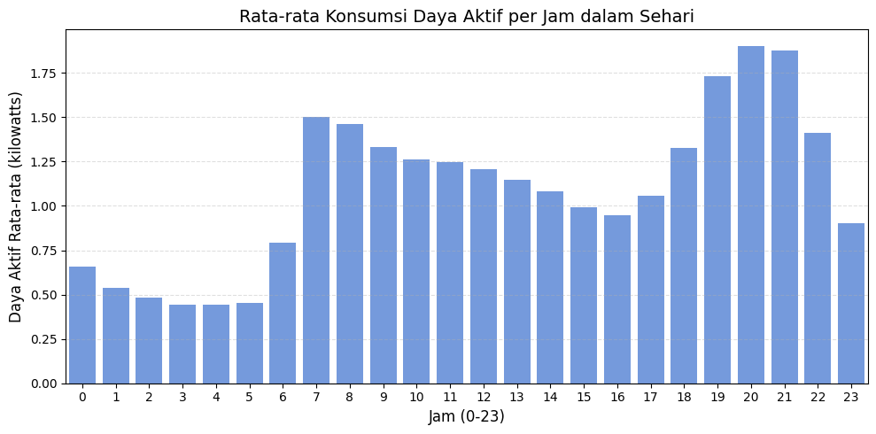
 
| Rentang Waktu | Konsumsi Rata-rata | Keterangan |
|---|---|---|
| 03.00 – 05.00 | ~0,44 – 0,45 kW | Terendah (dini hari) |
| 07.00 – 08.00 | ~1,5 kW | Naik tajam (rutinitas pagi) |
| Siang hari | ~1,0 – 1,3 kW | Sedikit menurun |
| 19.00 | ~1,73 kW | Menjelang puncak malam |
| **20.00** | **~1,90 kW** | **Puncak tertinggi harian** |
| 21.00 | ~1,87 kW | Setelah puncak malam |
 
### Pola Konsumsi per Hari dalam Seminggu
 
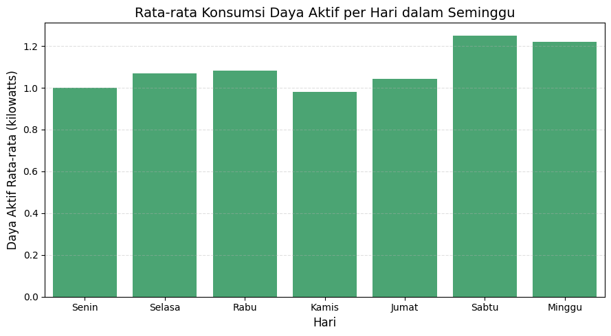
 
| Hari | Konsumsi Rata-rata |
|---|---|
| Senin | ~1,00 kW |
| Selasa | ~1,08 kW |
| Rabu | ~1,09 kW |
| Kamis | ~0,98 kW |
| Jumat | ~1,05 kW |
| **Sabtu** | **~1,25 kW** |
| **Minggu** | **~1,22 kW** |
 
> 💡 Sabtu dan Minggu lebih tinggi karena penghuni lebih banyak berada di rumah.
 
### Komposisi Energi Rumah Tangga
 
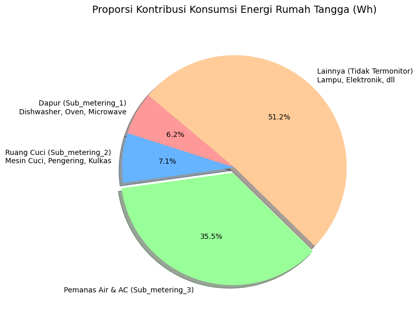
 
| Sub-meter | Area | Proporsi dari Total Energi |
|---|---|---|
| `Sub_metering_3` | Pemanas Air & AC | **35,5%** |
| `Sub_metering_2` | Ruang Cuci (Mesin Cuci, Pengering, Kulkas) | 7,1% |
| `Sub_metering_1` | Dapur (Dishwasher, Oven, Microwave) | 6,2% |
| Lainnya | Lampu, Elektronik, dll (tidak tercakup sub-meter) | **51,2%** |
 
> 💡 `Sub_metering_3` berkontribusi **72,7%** dari total energi yang termonitor oleh ketiga sub-meter saja (angka ini berbeda dari 35,5% karena 35,5% dihitung dari total termasuk kategori "Lainnya").
 
### Deteksi Outlier (Boxplot)
 
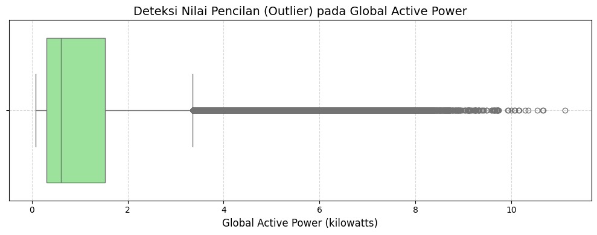
 
- **Median** konsumsi: ~0,6 kW
- **IQR**: 0,3 – 1,5 kW
- Ribuan titik outlier memanjang hingga **11 kW**
---
 
## 🔍 4. Diagnostic Analytics
 
### Correlation Matrix
 
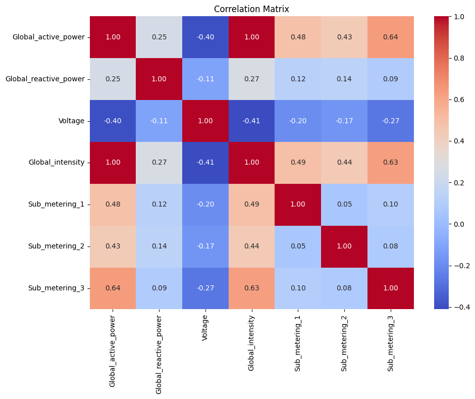
 
Tiga temuan penting dari matriks korelasi:
 
| Pasangan Variabel | Nilai Korelasi | Temuan |
|---|---|---|
| `Global_intensity` ↔ `Global_active_power` | **1,00** | Data leakage (P = V×I) — **tidak dipakai di model** |
| `Sub_metering_3` ↔ `Global_active_power` | **0,64** | Korelasi positif tertinggi di antara sub-meter |
| `Sub_metering_1` ↔ `Global_active_power` | 0,48 | Korelasi positif sedang |
| `Sub_metering_2` ↔ `Global_active_power` | 0,43 | Korelasi positif sedang |
| `Voltage` ↔ `Global_active_power` | **-0,40** | Korelasi negatif — dijelaskan di Diagnostic 3 |
 
---
 
### Diagnostic 1 — Komposisi Sub-metering: Konsumsi Normal vs Tinggi
 
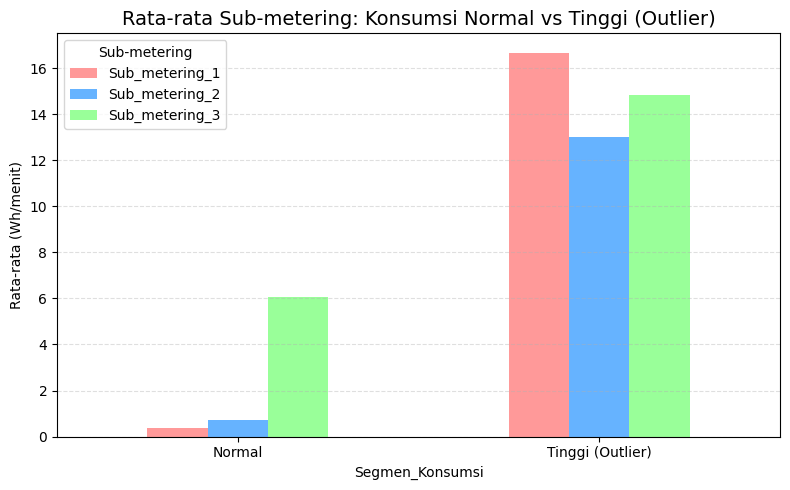
 
| Sub-meter | Konsumsi Normal (Wh/menit) | Konsumsi Tinggi/Outlier >3,36 kW (Wh/menit) | Kenaikan |
|---|---|---|---|
| `Sub_metering_1` (Dapur) | 0,37 | 16,68 | **≈45x** |
| `Sub_metering_2` (Ruang Cuci) | 0,73 | 13,02 | **≈18x** |
| `Sub_metering_3` (AC / Pemanas Air) | 6,05 | 14,83 | ≈2,5x |
 
> ⚠️ **Kesimpulan Diagnostic 1:** Lonjakan ekstrem (outlier >3,36 kW) dipicu utama oleh **aktivitas Dapur dan Ruang Cuci yang menyala bersamaan** — bukan AC/Pemanas Air, yang memang sudah punya beban dasar tinggi namun relatif stabil.
 
---
 
### Diagnostic 2 — Kontribusi Sub-metering per Jam dalam Sehari
 
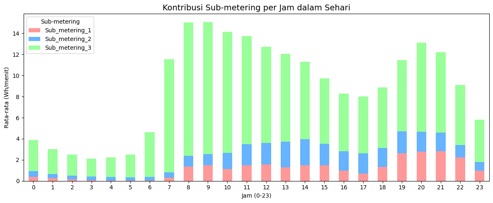
 
`Sub_metering_3` mendominasi hampir seluruh batang di setiap jam, terutama pada pukul **07.00–09.00** dan **19.00–21.00**, yang menjelaskan langsung pola puncak harian yang ditemukan di Descriptive.
 
| Fenomena | Penyebab Utama |
|---|---|
| Puncak harian (pagi & malam) | `Sub_metering_3` — Pemanas Air & AC |
| Lonjakan ekstrem (outlier) | `Sub_metering_1` & `Sub_metering_2` — Dapur & Laundry |
 
---
 
### Diagnostic 3 — Voltage Drop pada Beban Tinggi
 
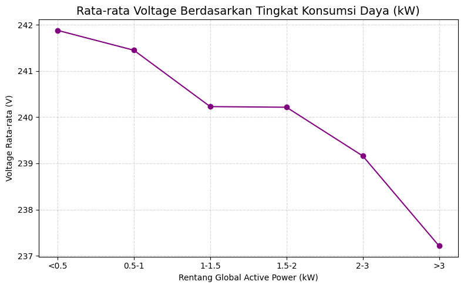
 
| Rentang Daya | Voltage Rata-rata |
|---|---|
| < 0,5 kW | 241,88 V |
| 0,5 – 1 kW | 241,45 V |
| 1 – 1,5 kW | 240,23 V |
| 1,5 – 2 kW | 240,21 V |
| 2 – 3 kW | 239,16 V |
| **> 3 kW** | **237,21 V** |
 
> ⚡ Tegangan turun monoton dari **241,88 V → 237,21 V** (penurunan ~1,93%) seiring meningkatnya konsumsi daya. Ini adalah fenomena **voltage drop** akibat impedansi jaringan saat arus naik — konsekuensi langsung dari **Hukum Ohm**, bukan korelasi kebetulan.
 
---
 
## 🤖 5. Predictive Analytics
 
### Konfigurasi Model
 
| Parameter | Detail |
|---|---|
| **Target Variabel** | `Global_active_power` |
| **Fitur yang Digunakan** | `Voltage`, `Global_reactive_power`, `Sub_metering_1`, `Sub_metering_2`, `Sub_metering_3` |
| **Fitur yang Dikeluarkan** | `Global_intensity` — korelasi 1,00 dengan target (data leakage) |
| **Split Data** | 80% Train / 20% Test |
| **Model 1** | Linear Regression |
| **Model 2** | Random Forest Regressor |
 
### Perbandingan Performa Model
 
| Metrik | Linear Regression | Random Forest | Pemenang |
|---|---|---|---|
| **MSE** | 0,2896 | 0,2543 | ✅ Random Forest |
| **RMSE** | 0,5382 | 0,5043 | ✅ Random Forest |
| **MAE** | 0,3663 | 0,3301 | ✅ Random Forest |
| **R²** | 0,7423 | **0,7737** | ✅ Random Forest |
 
> 💡 Random Forest unggul di semua metrik karena hubungan `Sub_metering_3`–`Global_active_power` bersifat **nonlinear**, dan Random Forest mampu menangkap interaksi antar fitur yang tidak dapat ditangkap oleh regresi linear.
 
### Feature Importance — Random Forest
 
| Ranking | Fitur | Importance Score |
|---|---|---|
| 🥇 1 | `Sub_metering_3` (AC & Pemanas Air) | **0,5390** |
| 🥈 2 | `Sub_metering_1` (Dapur) | 0,2224 |
| 🥉 3 | `Sub_metering_2` (Ruang Cuci) | 0,1695 |
| 4 | `Global_reactive_power` | 0,0414 |
| 5 | `Voltage` | 0,0277 |
 
### Koefisien — Linear Regression
 
| Fitur | Koefisien |
|---|---|
| `Voltage` | -0,0378 |
| `Global_reactive_power` | **0,8672** |
| `Sub_metering_1` | 0,0648 |
| `Sub_metering_2` | 0,0614 |
| `Sub_metering_3` | 0,0668 |
| *Intercept* | 9,5140 |
 
> 💡 Di Linear Regression, `Global_reactive_power` memiliki koefisien terbesar (0,867), namun di Random Forest *importance*-nya justru terkecil (0,041). Ini **bukan kontradiksi** — koefisien LR dipengaruhi skala fitur, sedangkan *importance* RF mengukur kontribusi nyata terhadap prediksi secara independen dari skala.
 
### Scatter Plot: Aktual vs Prediksi
 
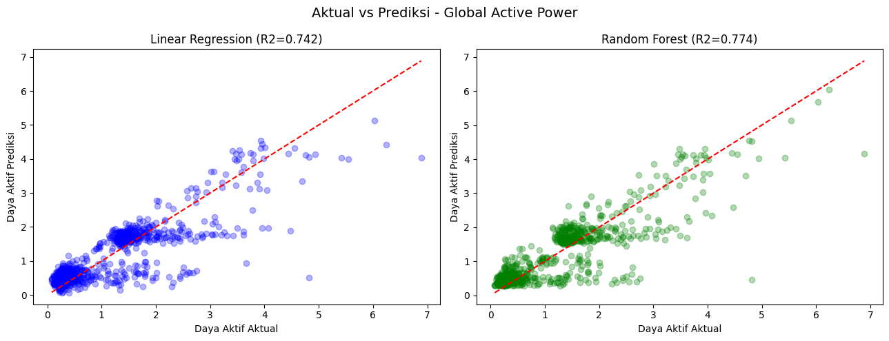
 
Kedua model mengikuti garis diagonal dengan baik pada konsumsi **0–2 kW** (mayoritas data), namun mulai menyimpang pada konsumsi **>3 kW** — wajar, karena event ekstrem jauh lebih sedikit jumlahnya sehingga model kurang terlatih untuk kasus tersebut.
 
---
 
## 💡 6. Temuan Utama dari Analisis Prediktif
 
### Temuan 1 — Pola Normal Sangat Bisa Diprediksi
Model mencapai akurasi tinggi (**R² = 0,774**) untuk konsumsi di rentang **0–2 kW**, yang merupakan mayoritas data. Artinya, rutinitas listrik rumah tangga sehari-hari memiliki pola yang sangat kuat dan dapat diantisipasi secara sistematis.
 
### Temuan 2 — "Terdakwa Utama" Lonjakan Daya
`Sub_metering_3` (AC & Pemanas Air) adalah **prediktor terkuat** dengan *importance score* **0,5390**. Jika aktivitas di sektor pengatur suhu ini terdeteksi naik, total beban jaringan (`Global_active_power`) secara matematis diprediksi akan mengalami lonjakan yang tajam.
 
### Temuan 3 — Anomali pada Beban Ekstrem (>3 kW)
Model kesulitan memprediksi konsumsi di atas **3 kW** karena lonjakan tersebut bersifat **spontan, tidak berpola, dan merupakan anomali**. Penyebabnya adalah aktivasi serentak peralatan Dapur dan Ruang Cuci secara bersamaan (contoh: oven + mesin cuci + AC menyala bersamaan).
 
---
 
## 🏢 7. Rekomendasi Bisnis untuk PLN / Utility Company
 
### ⚡ Rekomendasi 1 — Dynamic Load Forecasting (Optimalisasi Pembangkitan Daya)
 
| | Detail |
|---|---|
| **Insight** | Prediksi beban 0–2 kW sangat akurat dan terikat waktu. Puncak konsumsi konsisten terjadi pada pukul **07.00–09.00** dan **19.00–21.00**. |
| **Actionable** | PLN dapat **menjadwalkan operasi pembangkit secara dinamis**: menaikkan daya otomatis pada pukul 18.30 untuk menyambut lonjakan malam, lalu *ramp down* pada tengah malam. Tidak perlu menyalakan seluruh mesin pembangkit pada kapasitas maksimal selama 24 jam, sehingga menghemat biaya bahan bakar (batu bara/gas) yang terbuang sia-sia. |
 
---
 
### 💰 Rekomendasi 2 — Time-of-Use Pricing (Tarif Dinamis / Demand Response)
 
| | Detail |
|---|---|
| **Insight** | `Sub_metering_3` adalah prediktor terkuat (*importance* 0,5390). Jika aktivitas AC & Pemanas Air terdeteksi naik, beban jaringan diprediksi akan melonjak tajam. |
| **Actionable** | PLN dapat menerapkan program **Demand Response** melalui *Time-of-Use Pricing*: memberlakukan tarif listrik lebih tinggi secara otomatis pada pukul **19.00–21.00**, dan memberikan insentif tarif murah di luar jam tersebut. Kebijakan ini secara psikologis dan ekonomi akan menggeser kebiasaan masyarakat ke luar jam sibuk — meratakan kurva beban, mencegah *overload* gardu induk, dan menekan risiko pemadaman bergilir. |
 
---
 
### 🔧 Rekomendasi 3 — Predictive Maintenance Trafo (Berbasis Deteksi Anomali)
 
| | Detail |
|---|---|
| **Insight** | Model kesulitan memprediksi beban >3 kW (anomali spontan). Ditambah, terdapat *voltage drop* terkonfirmasi hingga **237 V** saat konsumsi ekstrem. |
| **Actionable** | Gunakan model sebagai **detektor anomali jaringan**. Jika suatu area perumahan sering memicu kejadian ekstrem >3 kW yang menyebabkan tegangan drop secara konstan, PLN dapat mengambil keputusan proaktif untuk **meng-upgrade kapasitas trafo (gardu distribusi)** di area tersebut — sebelum trafo meledak, terbakar, atau merusak perangkat elektronik warga akibat tegangan yang tidak stabil. |
 
---
 
## 📋 8. Ringkasan Hasil Akhir
 
| Tahap Analisis | Hasil |
|---|---|
| **Data Quality** | 2.049.280 baris bersih dari 2.075.259 awal • 0 duplikat • 181.853 missing value ditangani • **98,74% data dipertahankan** |
| **Descriptive** | Konsumsi rata-rata **1,09 kW** • `Sub_metering_3` = **72,7%** dari total yang termonitor 3 sub-meter • Puncak harian pukul 20.00 (1,90 kW) • Weekend lebih tinggi dari weekday |
| **Diagnostic** | Puncak harian → didorong AC/Pemanas Air • Lonjakan ekstrem → dipicu Dapur & Laundry • *Voltage drop* terkonfirmasi sesuai Hukum Ohm |
| **Predictive** | **Random Forest (R²=0,774)** lebih akurat dari Linear Regression (R²=0,742) • `Sub_metering_3` = fitur paling berpengaruh (importance: 0,5390) |
 
---
 
## ⚙️ Requirements
 
```bash
pip install pandas numpy matplotlib seaborn scikit-learn
```
 
---
 
## 🚀 Cara Menjalankan
 
```bash
# 1. Clone repository
git clone https://github.com/username/nama-repo.git
cd nama-repo
 
# 2. Install dependencies
pip install -r requirements.txt
 
# 3. Jalankan notebook
jupyter notebook notebook.ipynb
```
 
---
 
## 📚 Referensi
 
- **Dataset:** [UCI ML Repository — Individual Household Electric Power Consumption](https://archive.ics.uci.edu/dataset/235/individual+household+electric+power+consumption)
- **Algoritma:** Scikit-learn `RandomForestRegressor` & `LinearRegression`
---
 
*Laporan ini dibuat untuk keperluan analisis data dan rekomendasi operasional bagi perusahaan utilitas listrik.*
